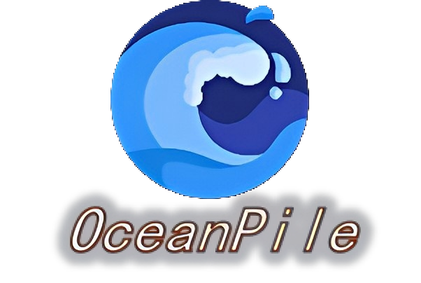
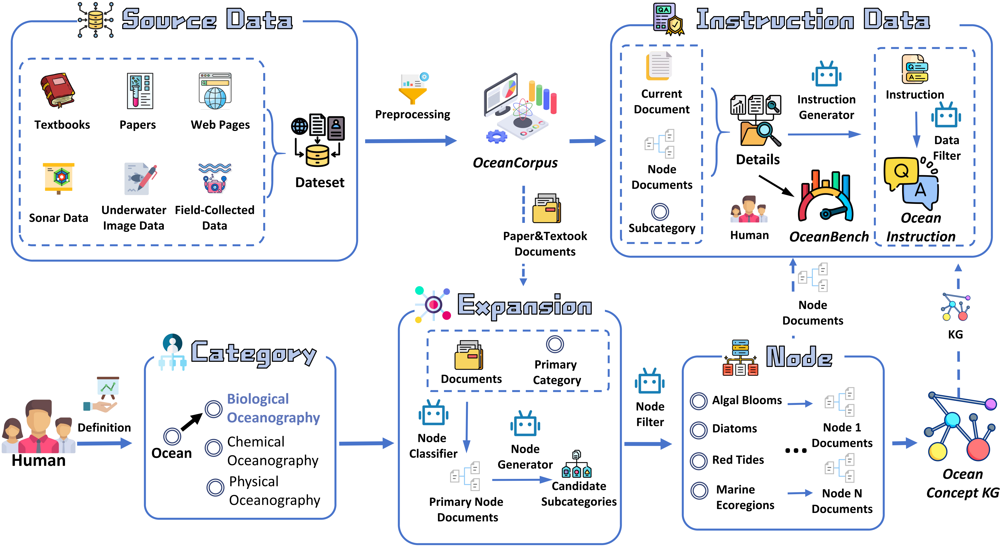

<p align="center">
  
</p>

<h3 align="center">OceanPile: A Large-Scale Multimodal Ocean Corpus for Foundation Models</h3>

<div align="center">

🌐 [Home Page](https://github.com/OceanGPT/OceanPile) 📄 [Paper](https://arxiv.org/abs) 🤗 [Hugging Face](https://huggingface.co/collections/zjunlp/oceanpile) 🌊 [Website](http://data.oceangpt.blue/en/)

</div>


**OceanPile**, a large-scale multimodal corpus designed for ocean intelligence. It comprises three key components: **OceanCorpus**, a unified collection integrating sonar data, underwater imagery, marine science visuals, and scientific text from diverse authoritative sources; **OceanInstruction**, a high-quality instruction dataset synthesized via a novel pipeline guided by a hierarchical **Ocean Concept Knowledge Graph**; and **OceanBench**, a manually curated evaluation benchmark for rigorous assessment.

# 🔔 News
- 04-2026, We released the OceanPile [models](https://huggingface.co/collections/zjunlp/oceanpile).
- 03-2026, We released the OceanPile [datasets](https://huggingface.co/collections/zjunlp/oceanpile).
- 02-2026, We launched the OceanPile project.

**Contents:**
- [🌟Overview](#-overview)
- [🔔 News](#-news)
- [📺 Quick Start](#-quick-start)
- [📚 Datasets](#-datasets)
- [🚩 Citation](#-citation)

# 🌟 Overview

<div align="center">

</div>

As illustrated, our approach begins with constructing a domain-specific knowledge graph by extracting and enriching concepts from authoritative scientific literature and structured marine data. Guided by this knowledge graph, we synthesize and validate instruction-response pairs, ensuring high-quality data that reflects the nature of marine science.

# 📚 DataSets
### 📘 Dataset Summary
|                              | # images | # samples               | # tokens | Download |
|------------------------------|----------|-------------------------|----------|----------|
| OceanCorpus                  | -        | &gt; 300K PDF documents | &gt; 50B | [🤗 Download](https://huggingface.co/datasets/zjunlp/OceanCorpus) |
| OceanInstruction       | 25,730        | 141,124                   | -        | [🤗 Download](https://huggingface.co/datasets/zjunlp/OceanInstruction) |
| OceanBench                   | 1,367    | 1,469                    | -        | [🤗 Download](https://huggingface.co/datasets/zjunlp/OceanBenchmark) |

More details about these datasets can be found in our [Paper](https://arxiv.org/abs) or [Hugging Face](https://huggingface.co/collections/zjunlp/oceanpile).

### 🤖 Model Zoo
| Model Name                       | Domain             | Download                                                                      |
|----------------------------------|--------------------|-------------------------------------------------------------------------------|
| OceanGPT-o-OceanPile-Sci      | Marine Science VQA | [🤗 Download](https://huggingface.co/zjunlp/OceanGPT-o-8B-OceanPile-Sci)      |
| OceanGPT-o-OceanPile-Sonar    | Sonar Image VQA    | [🤗 Download](https://huggingface.co/zjunlp/OceanGPT-o-8B-OceanPile-Sonar)    |
| OceanGPT-o-OceanPile-Bio      | Marine Biology VQA | [🤗 Download](https://huggingface.co/zjunlp/OceanGPT-o-8B-OceanPile-Bio)      |
# 🌊 Quick Start Guide

## 📦 Environment Setup

Create and activate a dedicated conda environment:

```bash
conda create -n oceanbench python=3.11
conda activate oceanbench
pip install -r requirements.txt
```

---

## 📥 Dataset Download

### Option 1: Using HuggingFace CLI

```bash
huggingface-cli download --repo-type dataset --resume-download zjunlp/OceanBenchmark --local-dir OceanBenchmark
```

### Option 2: Using Python

```python
from datasets import load_dataset

# Load the VQA evaluation subset
ds_test = load_dataset("zjunlp/OceanBenchmark", "Ocean_Science_VQA", split="test")
print(ds_test[0])
```

---

## 🤖 Model Download

### Option 1: Git LFS

```bash
git lfs install
git clone https://huggingface.co/zjunlp/OceanGPT-o-8B-OceanPile-Sci
```

### Option 2: HuggingFace CLI

```bash
huggingface-cli download --resume-download zjunlp/OceanGPT-o-8B-OceanPile-Sci \
    --local-dir OceanGPT-o-8B-OceanPile-Sci \
    --local-dir-use-symlinks False
```

### Option 3: Python (Transformers)

```python
from transformers import AutoModelForImageTextToText, AutoProcessor

model = AutoModelForImageTextToText.from_pretrained(
    "zjunlp/OceanGPT-o-8B-OceanPile-Sci",
    dtype="auto",
    device_map="auto"
)

processor = AutoProcessor.from_pretrained("zjunlp/OceanGPT-o-8B-OceanPile-Sci")
```

---

## 🖼️ Inference

```python
from transformers import Qwen3VLForConditionalGeneration, AutoProcessor

# Load model on available device(s)
model = Qwen3VLForConditionalGeneration.from_pretrained(
    "zjunlp/OceanGPT-o-8B-OceanPile-Sci",
    dtype="auto",
    device_map="auto"
)

processor = AutoProcessor.from_pretrained("zjunlp/OceanGPT-o-8B-OceanPile-Sci")

# Prepare message with image and text
messages = [
    {
        "role": "user",
        "content": [
            {"type": "image", "image": "file:///path/to/your/image.jpg"},
            {"type": "text", "text": "Describe this image."},
        ],
    }
]

# Tokenize inputs
inputs = processor.apply_chat_template(
    messages,
    tokenize=True,
    add_generation_prompt=True,
    return_dict=True,
    return_tensors="pt"
)
inputs = inputs.to(model.device)

# Generate response
generated_ids = model.generate(**inputs, max_new_tokens=128)
generated_ids_trimmed = [
    out_ids[len(in_ids):] for in_ids, out_ids in zip(inputs.input_ids, generated_ids)
]

# Decode output
output_text = processor.batch_decode(
    generated_ids_trimmed,
    skip_special_tokens=True,
    clean_up_tokenization_spaces=False
)
print(output_text)
```

---

## 📊 Evaluation with OceanBenchmark
More details see eval folder.
### 🟢 Marine Science VQA Evaluation (API)
```bash
python eval/sci_eval.py --input_dir "YOUR_DATA_DIR" --type qa --eval_model gpt-4o
```

### 🟢 Marine Science QA Evaluation (API)
```bash
python eval/eval.py --input_dir "YOUR_DATA_DIR" --type vqa --eval_model gpt-4o
```

### 🔵 Marine Science VQA Evaluation (Local Model)
```bash
python eval/eval.py --input_dir "YOUR_DATA_DIR" --type vqa \
    --eval_model qwen3-vl --local \
    --local_model_path "YOUR_LOCAL_MODEL_PATH"
```
### 🔏 License
This dataset is released under MIT License.

# 🚩 Citation

If this OceanPile paper or datasets is helpful, please kindly cite as this:

```bibtex


```

💐 Citations for our other related works:
```bibtex
@misc{xue2025oceangymbenchmarkenvironmentunderwater,
      title={OceanGym: A Benchmark Environment for Underwater Embodied Agents}, 
      author={Yida Xue and Mingjun Mao and Xiangyuan Ru and Yuqi Zhu and Baochang Ren and Shuofei Qiao and Mengru Wang and Shumin Deng and Xinyu An and Ningyu Zhang and Ying Chen and Huajun Chen},
      year={2025},
      eprint={2509.26536},
      archivePrefix={arXiv},
      primaryClass={cs.CL},
      url={https://arxiv.org/abs/2509.26536}, 
}

@article{bi2024oceangpt,
  title={OceanGPT: A Large Language Model for Ocean Science Tasks},
  author={Bi, Zhen and Zhang, Ningyu and Xue, Yida and Ou, Yixin and Ji, Daxiong and Zheng, Guozhou and Chen, Huajun},
  journal={arXiv preprint arXiv:2310.02031},
  year={2024}
}
```
